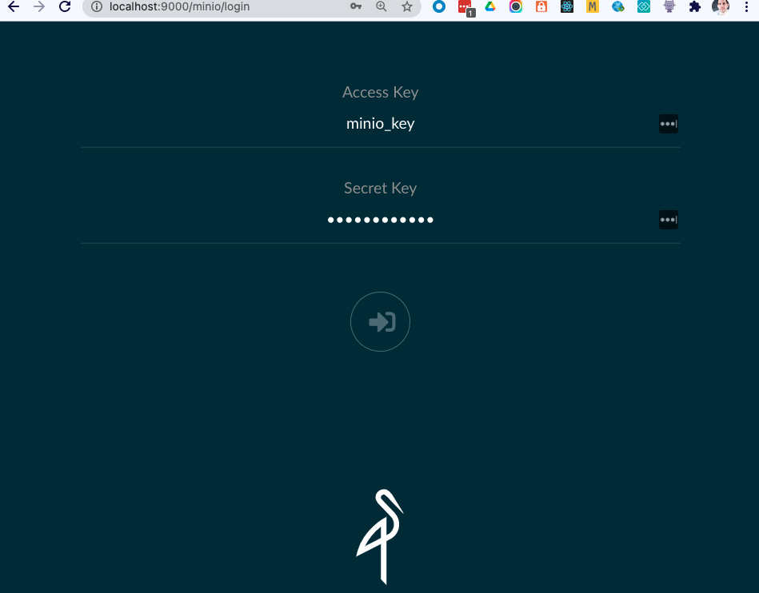
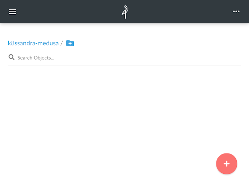
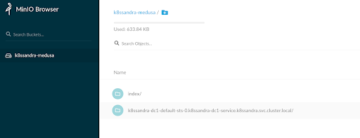

# Backing up K8ssandra with MinIO

K8ssandra includes Medusa for Apache Cassandra™ to handle backup and restore for your Cassandra nodes. Recently Medusa was upgraded to introduce support for all S3 compatible backends, including [MinIO](https://min.io/), the popular k8s-native object storage suite. Let’s see how to set up K8ssandra and MinIO to backup Cassandra in just a few steps.

# Deploy MinIO

Similar to K8ssandra, MinIO can be simply deployed through Helm.

First, add the MinIO repository to your local list:

```
helm repo add minio https://helm.min.io/
```

The MinIO Helm charts allow you to do several things at once at install time:

*   Set the credentials to access MinIO
*   Create a bucket for your backups that can be set as default

You can create a **k8ssandra-medusa** bucket and use **minio_key/minio_secret** as the credentials, and deploy MinIO in a new namespace called **minio** by running the following command:

```
helm install --set accessKey=minio_key,secretKey=minio_secret,defaultBucket.enabled=true,defaultBucket.name=k8ssandra-medusa minio minio/minio -n minio --create-namespace
```

**Note:** Creating the bucket is not mandatory at this stage and can be done through MinIO’s UI.

After the `helm install` command has completed, you should see something similar to this in the **minio** namespace: 

```
% kubectl get all -n minio
NAME                        READY   STATUS    RESTARTS   AGE
pod/minio-5fd4dd687-gzr8j   1/1     Running   0          109s

NAME            TYPE        CLUSTER-IP     EXTERNAL-IP   PORT(S)    AGE
service/minio   ClusterIP   10.96.144.61   <none>        9000/TCP   109s

NAME                    READY   UP-TO-DATE   AVAILABLE   AGE
deployment.apps/minio   1/1     1            1           109s

NAME                              DESIRED   CURRENT   READY   AGE
replicaset.apps/minio-5fd4dd687   1         1         1       109s
```

Using port forwarding, you can expose access to the MinIO UI in the browser on port 9000:

```
% kubectl port-forward service/minio 9000 -n minio
Forwarding from 127.0.0.1:9000 -> 9000
Forwarding from [::1]:9000 -> 9000
```

Now you can login to MinIO at [http://localhost:9000](http://localhost:9000) using your install time defined credentials (if you used the same commands above they would be `minio_key` and `minio_secret`):



Once logged in, you can see that the k8ssandra-medusa bucket was created and is currently empty:



# Deploy K8ssandra

Now that MinIO is up and running, you can create a namespace for your K8ssandra installation and create a secret for Medusa to access the bucket. Create a `medusa_secret.yaml` file with the following content:

```
apiVersion: v1
kind: Secret
metadata:
 name: medusa-bucket-key
type: Opaque
stringData:
 # Note that this currently has to be set to medusa_s3_credentials!
 medusa_s3_credentials: |-
   [default]
   aws_access_key_id = minio_key
   aws_secret_access_key = minio_secret

```

Now create the `k8ssandra` namespace and the Medusa secret with the following commands:

```
kubectl create namespace k8ssandra
kubectl apply -f medusa_secret.yaml -n k8ssandra
```

You should now see the **medusa-bucket-key** secret in the **k8ssandra** namespace:

```
% kubectl get secrets -n k8ssandra
NAME                  TYPE                                  DATA   AGE
default-token-twk5w   kubernetes.io/service-account-token   3      4m49s
medusa-bucket-key     Opaque                                1      45s
```

You can then deploy K8ssandra with the following custom values file (all default values will be used if not customized here) :

```yaml
medusa:
  enabled: true
  storage: s3_compatible
  storage_properties:
      host: minio.minio.svc.cluster.local
      port: 9000
      secure: "False"
  bucketName: k8ssandra-medusa
  storageSecret: medusa-bucket-key
```

Save the above file as `k8ssandra_medusa_minio.yaml` and then install K8ssandra with the following command:

```
helm install k8ssandra k8ssandra/k8ssandra -f k8ssandra_medusa_minio.yaml -n k8ssandra
```

Now wait for the Cassandra cluster to be ready by using the following wait command:

```
kubectl wait --for=condition=Ready cassandradatacenter/dc1 --timeout=900s -n k8ssandra
```

You should now see a list of pods similar to this:

```
% kubectl get pods -n k8ssandra
NAME                                                  READY   STATUS      RESTARTS   AGE
k8ssandra-cass-operator-547845459-dwg68               1/1     Running     0          6m36s
k8ssandra-dc1-default-sts-0                           3/3     Running     0          5m56s
k8ssandra-dc1-stargate-776f88f945-p9twg               0/1     Running     0          6m36s
k8ssandra-grafana-75b9cb64cc-kndtc                    2/2     Running     0          6m36s
k8ssandra-kube-prometheus-operator-5bdd97c666-qz5vv   1/1     Running     0          6m36s
k8ssandra-medusa-operator-d766d5b66-wjt7j             1/1     Running     0          6m36s
k8ssandra-reaper-5f9bbfc989-j59xk                     1/1     Running     0          2m48s
k8ssandra-reaper-operator-858cd89bdd-7gfjj            1/1     Running     0          6m36s
k8ssandra-reaper-schema-4gshj                         0/1     Completed   0          3m3s
prometheus-k8ssandra-kube-prometheus-prometheus-0     2/2     Running     1          6m32s
```

# Create some data and back it up

Extract the username and password to access Cassandra (the password is different for each installation unless it is explicitly set at install time) into variables:
\```
% username=$(kubectl get secret k8ssandra-superuser -n k8ssandra -o jsonpath="{.data.username}" | base64 --decode)
% password=$(kubectl get secret k8ssandra-superuser -n k8ssandra -o jsonpath="{.data.password}" | base64 --decode)
\```
Connect through CQLSH on one of the nodes:
\```
% kubectl exec -it k8ssandra-dc1-default-sts-0 -n k8ssandra -c cassandra -- cqlsh -u $username -p $password
\```
Copy/paste the following statements into the CQLSH prompt and press enter:
\```
CREATE KEYSPACE medusa_test  WITH replication = {'class': 'SimpleStrategy', 'replication_factor': 1};
USE medusa_test;
CREATE TABLE users (email TEXT PRIMARY KEY, name TEXT, state TEXT);
INSERT INTO users (email, name, state) VALUES ('alice@example.com', 'Alice Smith', 'TX');
INSERT INTO users (email, name, state) VALUES ('bob@example.com', 'Bob Jones', 'VA');
INSERT INTO users (email, name, state) VALUES ('carol@example.com', 'Carol Jackson', 'CA');
INSERT INTO users (email, name, state) VALUES ('david@example.com', 'David Yang', 'NV');
\```
Check that the rows were properly inserted:
\```
SELECT * FROM medusa_test.users;

 email             | name          | state
-------------------+---------------+-------
 alice@example.com |   Alice Smith |    TX
   bob@example.com |     Bob Jones |    VA
 david@example.com |    David Yang |    NV
 carol@example.com | Carol Jackson |    CA

(4 rows)
\```

Now backup this data, and check that files get created in your MinIO bucket. 

To that end, use the following command:

```
helm install my-backup k8ssandra/backup -n k8ssandra --set name=backup1,cassandraDatacenter.name=dc1
```

Since the backup operation is asynchronous, you can monitor its completion by running the following command:

```
kubectl get cassandrabackup backup1 -n k8ssandra -o jsonpath={.status.finishTime}
```

As long as this doesn’t output a date and time, then the backup is still running. With the amount of data present and the fact that you’re using a locally accessible backend, this should complete quickly.

Now refresh the MinIO UI and you should see some files in the k8ssandra-medusa bucket:



An index folder should appear (it is Medusa’s backup index) and then another folder that is specific to each Cassandra node in the cluster (in this case there is only one node).

# Deleting the data and restoring the backup

Delete rows one by one, and check that the table is empty:

\```
% kubectl exec -it k8ssandra-dc1-default-sts-0 -n k8ssandra -c cassandra -- cqlsh -u $username -p $password

DELETE FROM medusa_test.users where email='alice@example.com';
DELETE FROM medusa_test.users where email='bob@example.com';
DELETE FROM medusa_test.users where email='david@example.com';
DELETE FROM medusa_test.users where email='carol@example.com';

SELECT * FROM medusa_test.users;

 email | name | state
-------+------+-------


(0 rows)
\```

Now restore the backup taken previously:

```
helm install restore-test k8ssandra/restore --set name=restore-backup1,backup.name=backup1,cassandraDatacenter.name=dc1 -n k8ssandra
```

This operation will take a little longer as it requires to stop the StatefulSet pod and perform the restore as part of the init containers, before the Cassandra container can start. You can monitor progress using this command:

```
watch -d kubectl get cassandrarestore restore-backup1 -o jsonpath={.status} -n k8ssandra
```

The restore operation is fully completed once the **finishTime** value appears in the output:

```
{"finishTime":"2021-03-23T13:58:36Z","restoreKey":"83977399-44dd-4752-b4c4-407273f0339e","startTime":"2021-03-23T13:55:35Z"}
```

Check that you can read the data from the previously truncated table:

```
% kubectl exec -it k8ssandra-dc1-default-sts-0 -n k8ssandra -c cassandra -- cqlsh -u k8ssandra-superuser -p XHsZ943WBg5RPNhVAT8x -e "SELECT * FROM medusa_test.users"

 email             | name          | state
-------------------+---------------+-------
 alice@example.com |   Alice Smith |    TX
   bob@example.com |     Bob Jones |    VA
 david@example.com |    David Yang |    NV
 carol@example.com | Carol Jackson |    CA

(4 rows)
```

You’ve successfully restored your lost data in just a few commands!

# Many backends available

MinIO, while being an obvious choice in the Kubernetes world, is not the only S3 compatible backend that K8ssandra can use. K8ssandra has supported AWS S3 and Google Cloud Storage as Medusa backends since 1.0.0. There is also a wide variety of solutions that can run on-prem (including CEPH, Cloudian, Riak S2, and Dell EMC ECS) or in cloud environments (including IBM Cloud Object Storage, and OVHcloud Object Storage). See the [K8ssandra backup/restore documentation](https://k8ssandra.io/docs/topics/restore-a-backup/) for more detailed instructions and let us know if you have questions, we love to help!
