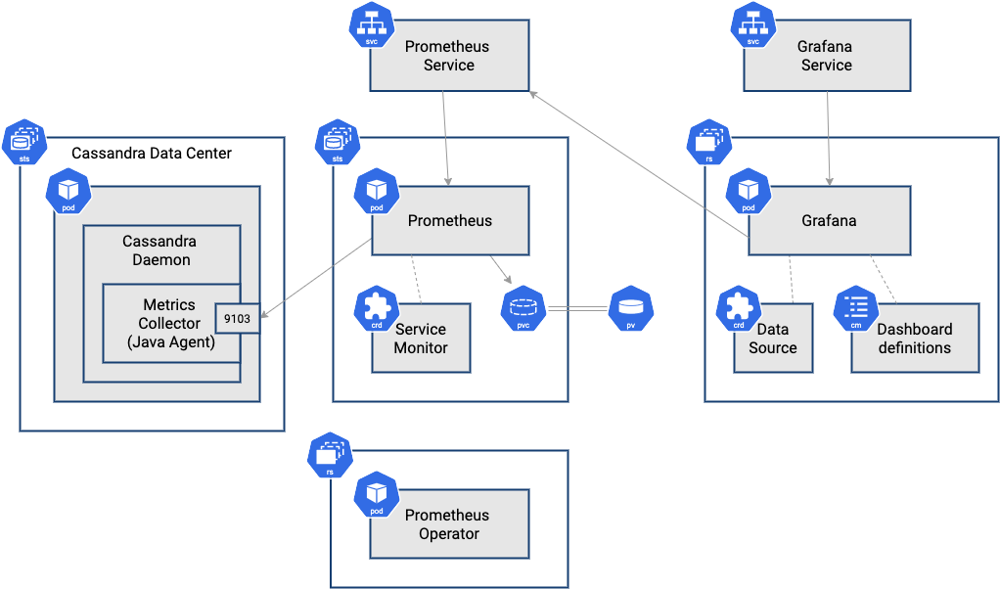

When running applications in Kubernetes, observability is key. K8ssandra includes Prometheus and Grafana for the storage and visualization of metrics associated with the Cassandra cluster.

Cassandra node-level metrics are reported in the Prometheus format, covering everything from operations per second and latency, to compaction throughput and heap usage. Examples of these metrics are shown in the Grafana dashboard below.

## Architecture details

K8ssandra uses the [kube-prometheus-stack](https://github.com/prometheus-community/helm-charts/tree/main/charts/kube-prometheus-stack), a Helm chart from the [Prometheus Community](https://prometheus.io/community/) project, to deploy Prometheus and Grafana and connect them to Cassandra, as shown in the figure below.

Let's walk through this architecture from left to right. We'll provide links to the Kubernetes documentation so you can dig into those concepts more if you'd like to.

The Cassandra nodes in a K8ssandra-managed cluster are organized in one or more datacenters, each of which is composed of one or more racks. Each rack represents a failure domain with replicas being placed across multiple racks (if present). In Kubernetes, racks are represented as [StatefulSets](https://kubernetes.io/docs/concepts/workloads/controllers/statefulset/). (We'll focus here on details of the Cassandra node related to monitoring, you can see other details about Cassandra nodes such as how storage is managed on the [Cassandra architecture](/docs/architecture/cassandra) page.)

Each Cassandra node is deployed as its own [pod](https://kubernetes.io/docs/concepts/workloads/pods/). The pod runs the Cassandra daemon in a Java VM. Each Apache Cassandra pod is configured with the DataStax [Metrics Collector for Apache Cassandra](https://github.com/datastax/metric-collector-for-apache-cassandra), which is implemented as a Java agent running in that same VM. The Metrics Collector is configured to expose metrics on the standard Prometheus port (9103).

One or more Prometheus instances are deployed in another StatefulSet, with the default configuration starting with a single instance. Using a StatefulSet allows each Prometheus node to connect to a Persistent Volume (PV) for longer term storage. The default K8ssandra chart configuration does not use PVs. By default, metric data collected in the cluster is retained within Prometheus for 24 hours.

An instance of the Prometheus Operator is deployed using a Replica Set. The `kube-prometheus-stack` also defines several useful Kubernetes [custom resources (CRDs)](https://kubernetes.io/docs/concepts/extend-kubernetes/api-extension/custom-resources/) that the Prometheus Operator uses to manage Prometheus. One of these is the `ServiceMonitor`. K8ssandra uses `ServiceMonitor` resources, specifying labels selectors to indicate the Cassandra pods to connect to in each datacenter, and how to relabel each metric as it is stored in Prometheus. K8ssandra provides a `ServiceMonitor` for Stargate when it is enabled. Users may also configure `ServiceMonitors` to pull metrics from the various operators, but pre-configured instances are not provided at this time.

The `AlertManager` is an additional resource provided by `kube-prometheus-stack` that can be configured to specify thresholds for specific metrics that will trigger alerts. Users may enable, and configure, AlertManager through the `values.yaml` file. See the `kube-prometheus-stack` [example](https://github.com/prometheus-community/helm-charts/blob/main/charts/kube-prometheus-stack/values.yaml#L114-L595) for more information.
  
An instance of Grafana is deployed in a Replica Set. The `GrafanaDataSource` is yet another resource defined by `kube-prometheus-stack`, which is used to describe how to connect to the Prometheus service. Kubernetes config maps are used to populate `GrafanaDashboard` resources. These dashboards can be combined or customized.

Ingress or port forwarding can be used to expose access to the Prometheus and Grafana services external to the Kubernetes cluster.

## Next

Check out the [monitoring tasks](/docs/topics/monitoring) for more detailed instructions.

Next architecture topic: [Repairs with Cassandra Reaper]()
